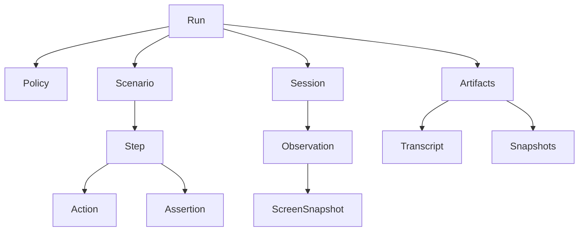

# Data Model (Source of Truth)

This document defines the canonical data model, types, and API contracts for `tui-use`. It is a living document and the source of truth for how the app behaves.

## Change control (how to evolve this doc)
- Any change to public types, CLI protocol, scenario format, default policy behavior, or error codes **must** update:
  - `spec/data-model.md` (this document)
  - `CHANGELOG.md`
  - `spec/feature-list.json` (add/adjust acceptance tests)
- Backwards-incompatible changes must bump a **protocol version** and be explicitly called out in `CHANGELOG.md`.

## Core concepts
- **Run**: a top-level execution of `tui-use` (CLI invocation or library call).
- **Session**: a live PTY-backed child process being driven.
- **Scenario**: a declarative list of steps (actions + assertions) executed by the runner.
- **Action**: what a human does (keypress, typed text, resize, wait, terminate).
- **Observation**: what a human sees (screen snapshot, cursor, transcript delta, events).
- **Policy**: guardrails; deny-by-default configuration for exec/fs/env/network/budgets.
- **Sandbox**: OS-backed isolation enforcing parts of the policy.
- **Artifacts**: transcript, snapshots, and run metadata written to disk for debugging/regression.

## Entity relationships (high level)

## Canonical IDs
All IDs are opaque, stable identifiers used in logs, artifacts, and protocol messages.

- `RunId`: unique per run
- `SessionId`: unique per session
- `StepId`: unique per scenario step (stable within a scenario)
- `SnapshotId`: unique per captured snapshot

Implementation note (Rust): represent as newtypes around UUID/ULID to avoid accidental mix-ups.

## Types (canonical)
The following is the canonical shape for types. Rust names are normative; JSON keys must match unless a versioned migration is introduced.

### Versions
Version fields exist to avoid surprises and make automated consumers robust.

- `protocol_version: u32`: version of CLI JSON output and NDJSON interactive messages.
- `scenario_version: u32`: version of the scenario schema.
- `policy_version: u32`: version of the policy schema.
- `snapshot_version: u32`: version of the screen snapshot schema.
- `run_result_version: u32`: version of the run result schema (`run.json`).

Rules:
- Backwards-incompatible changes must bump the relevant version(s) and be called out in `CHANGELOG.md`.
- Every CLI JSON/NDJSON message must include `protocol_version`.

Examples:
- `spec/examples/policy.json`
- `spec/examples/normalization.json`
- `spec/examples/replay.json`

### Policy
`Policy` is deny-by-default and must be explicit about any privilege.

 - `policy_version: u32` (current: 3)
- `sandbox: SandboxMode`
- `sandbox_unsafe_ack: bool` (default false; must be true when `sandbox: none`)
- `network: NetworkPolicy`
- `network_unsafe_ack: bool` (default false; must be true when `network: enabled`; also required when `sandbox: none` because network policy cannot be enforced without a sandbox)
- `fs: FsPolicy`
- `fs_write_unsafe_ack: bool` (default false; must be true when `fs.allowed_write` is non-empty)
- `fs_strict_write: bool` (default false; when true, any write access requires `fs_write_unsafe_ack: true` even if `fs.allowed_write` is empty)
- `exec: ExecPolicy`
- `env: EnvPolicy`
- `budgets: Budgets`
- `artifacts: ArtifactsPolicy`
- `replay: ReplayPolicy`

#### SandboxMode
- `seatbelt`: default; use a Seatbelt profile (e.g. `sandbox-exec`) to restrict the child
- `none`: only allowed when `sandbox_unsafe_ack: true`; must be logged prominently

#### NetworkPolicy
- `disabled`: default
- `enabled`: explicit opt-in (still subject to sandbox enforcement capability)

Safety guard: enabling `network` requires explicit acknowledgement (`network_unsafe_ack: true`). When sandboxing is disabled, network policy cannot be enforced, so `network_unsafe_ack` must still be true even if `network` is disabled.

#### FsPolicy
- `allowed_read: [Path]` (absolute allowlist; empty means “deny all reads except system baseline required by the host OS + runtime”)
- `allowed_write: [Path]` (absolute allowlist; default should be an artifacts dir + an internal temp dir)
- `working_dir: Path` (absolute path; must be inside an allowed read/write root; otherwise deny)

Safety guard: allowlisting `/`, the current user's home directory, or system roots like `/System`, `/Library`, `/Users`, `/private`, or `/Volumes` is rejected with `E_POLICY_DENIED` to prevent catastrophic access. Prefer a dedicated workspace or temp directory with the minimum required scope. When `fs_strict_write` is enabled, any write access (artifacts or sandbox profile writes) requires `fs_write_unsafe_ack: true`.
All filesystem paths are normalized (resolving `.` and `..`) before allowlist checks; traversal cannot bypass allowlisted roots.
Write access requires explicit acknowledgement via `fs_write_unsafe_ack: true` when `allowed_write` is non-empty.

#### ExecPolicy
- `allowed_executables: [Path]` (absolute paths; default empty ⇒ deny)
- `allow_shell: bool` (default false; when false, argv exec only; no `sh -c`)

#### EnvPolicy
- `allowlist: [String]` (exact env var names)
- `set: {String: String}` (explicit environment values applied to the child)
- `inherit: bool` (default false or narrowly scoped; if true, still filtered by allowlist)

#### Budgets
- `max_runtime_ms: u64`
- `max_steps: u64`
- `max_output_bytes: u64` (combined transcript + terminal stream budget)
- `max_snapshot_bytes: u64`
- `max_wait_ms: u64` (per wait)

#### ArtifactsPolicy
- `enabled: bool`
- `dir: Path` (absolute path; required when enabled; used if CLI does not supply `--artifacts`)
- `overwrite: bool`

Artifacts writes must stay within filesystem write allowlists. The artifacts dir is validated against `fs.allowed_write` (after path normalization) and denied with `E_POLICY_DENIED` if it falls outside.

#### ReplayPolicy
- `strict: bool` (default false; disables normalization when true)
- `normalization_filters: [NormalizationFilter]?` (optional; when set, overrides default replay normalization)
- `normalization_rules: [NormalizationRule]?` (optional; regex replacements applied during replay)

Replay normalization is driven by the policy unless the CLI explicitly overrides it (e.g., `--strict` or `--normalize`). When strict is true, normalization filters are ignored and comparisons are exact.

### Scenario
Scenarios are deterministic “scripts” for driving TUIs.

- `scenario_version: u32`
- `metadata: ScenarioMetadata`
- `run: RunConfig`
- `steps: [Step]`

#### RunConfig
- `command: Path`
- `args: [String]`
- `cwd: Path` (absolute path)
- `initial_size: TerminalSize` (`rows`, `cols`)
- `policy: PolicyRef | InlinePolicy` (either reference a policy file or embed)

#### Step
- `id: StepId`
- `name: String`
- `action: Action`
- `assert: [Assertion]` (assertions to satisfy after performing the action)
- `timeout_ms: u64` (step budget)
- `retries: u32` (for “eventually consistent” terminal updates)

### Action
Actions are the only allowed way to interact with the session.

- `key`: press one key or a chord
- `text`: type/paste text
- `resize`: change PTY size
- `wait`: wait until a condition is satisfied (or timeout)
- `terminate`: terminate the child (graceful, then forceful)

Suggested canonical fields:
- `type: "key" | "text" | "resize" | "wait" | "terminate"`
- `payload: {...}`

### Assertion
Assertions verify expected outcomes. Failures are explicit and produce structured diagnostics.

Common assertions:
- Screen contains text
- Screen matches regex
- Line equals / starts with / ends with
- Cursor at position
- Process exited with code
- No crash / no unexpected exit

Suggested canonical fields:
- `type: String` (e.g. `"screen_contains"`)
- `payload: {...}`

### Observation
Observations are what the runner returns (and what the interactive protocol streams).

- `protocol_version: u32`
- `run_id: RunId`
- `session_id: SessionId`
- `timestamp_ms: u64` (monotonic time since run start)
- `screen: ScreenSnapshot`
- `transcript_delta: String?` (optional; incremental output since last observation)
- `events: [Event]`

### ScreenSnapshot
A canonical, stable representation of the terminal state.

- `snapshot_version: u32`
- `snapshot_id: SnapshotId`
- `rows: u16`
- `cols: u16`
- `cursor: Cursor`
- `alternate_screen: bool`
- `lines: [String]` (normalized, printable text lines; `rows` long)
- `cells: [[Cell]]?` (optional; include when style/attributes are needed)

Normalization rules (must be explicit and versioned):
- Normalize CRLF / CR behavior into lines.
- Replace unsupported/unprintable glyphs with a replacement character (and record an event).
- Optional “flakiness filters” (spinners/timestamps) are **opt-in** and must be recorded in artifacts.

### TerminalSize
- `rows: u16`
- `cols: u16`

### Cursor
- `row: u16` (0-based)
- `col: u16` (0-based)
- `visible: bool`

### Cell (optional)
Cells are only required when style/attributes are needed; most assertions should prefer `lines`.

- `ch: String` (single grapheme)
- `width: u8` (grapheme cell width; typically 1 or 2)
- `style: Style`

### Style (optional)
- `fg: Color`
- `bg: Color`
- `bold: bool`
- `italic: bool`
- `underline: bool`
- `inverse: bool`

### Color (optional)
- `default`
- `ansi_16: u8` (0-15)
- `ansi_256: u8` (0-255)
- `rgb: { r: u8, g: u8, b: u8 }`

### Artifacts
Artifacts are the on-disk trace of a run.

- `artifacts_dir/`
  - `run.json` (RunResult; includes `run_result_version` and `protocol_version`)
  - `transcript.log`
  - `snapshots/0001.json` (ScreenSnapshot)
  - `events.jsonl` (optional NDJSON stream of `Observation` records)
  - `normalization.json` (NormalizationRecord; replay normalization filters applied)
  - `checksums.json` (map of artifact relative paths to 64-bit checksums)
  - `policy.json` (effective policy)
  - `scenario.json` (resolved scenario)
  - `replay.json` (ReplaySummary; written into `replay-<run_id>/` during replay)
  - `diff.json` (ReplayDiff; written into `replay-<run_id>/` when replay fails)

### RunResult (run.json)
`RunResult` is the canonical summary produced by `tui-use` for automation and reporting.

- `run_result_version: u32`
- `protocol_version: u32`
- `run_id: RunId`
- `status: "passed" | "failed" | "errored" | "canceled"`
- `started_at_ms: u64` (monotonic, since process start)
- `ended_at_ms: u64`
- `command: String`
- `args: [String]`
- `cwd: String`
- `policy: Policy` (effective policy)
- `scenario: Scenario?` (resolved scenario when applicable)
- `steps: [StepResult]?` (scenario mode)
- `final_observation: Observation?`
- `exit_status: ExitStatus?`
- `error: ErrorInfo?` (present when `status != "passed"`)

### StepResult
- `step_id: StepId`
- `name: String`
- `status: "passed" | "failed" | "errored" | "skipped"`
- `attempts: u32`
- `started_at_ms: u64`
- `ended_at_ms: u64`
- `action: Action`
- `assertions: [AssertionResult]`
- `error: ErrorInfo?`

### AssertionResult
- `type: String`
- `passed: bool`
- `message: String?`
- `details: JsonValue?` (structured diagnostics; versioned by `protocol_version`)

### ExitStatus
- `success: bool`
- `exit_code: i32?` (when exited normally)
- `signal: i32?` (when terminated by signal)

### NormalizationRecord (normalization.json)
Normalization is only applied during replay comparisons. The applied filters must be recorded.

- `normalization_version: u32`
- `filters: [NormalizationFilter]`
- `strict: bool`
- `source: "default" | "policy" | "cli" | "none"`
- `rules: [NormalizationRule]` (optional; regex replacements)

### ReplaySummary (replay.json)
Replay summary written alongside replay artifacts.

- `replay_version: u32`
- `status: "passed" | "failed"`
- `source: "default" | "policy" | "cli" | "none"`
- `strict: bool`
- `filters: [NormalizationFilter]`
- `rules: [NormalizationRule]`
- `mismatch: { kind: String, index: u64? }?`

### ReplayDiff (diff.json)
- `code: String`
- `message: String`
- `context: JsonValue?`

### NormalizationFilter
Canonical filters (snake_case):
- `snapshot_id` (ignore `snapshot_id` fields)
- `run_id` (ignore `run_id` fields)
- `run_timestamps` (ignore run `started_at_ms`/`ended_at_ms`)
- `step_timestamps` (ignore step `started_at_ms`/`ended_at_ms`)
- `observation_timestamp` (ignore observation `timestamp_ms`)
- `session_id` (ignore observation `session_id`)

### NormalizationRule
- `target: "transcript" | "snapshot_lines"`
- `pattern: String` (regex)
- `replace: String`
- `terminated_by_harness: bool`

### ErrorInfo
- `code: String` (stable error code)
- `message: String`
- `context: JsonValue?`

### Event
Events capture notable occurrences that should not be inferred from `lines` alone.

Examples:
- terminal title set
- unsupported escape sequence observed
- output budget nearing exhaustion

Suggested canonical fields:
- `type: String`
- `message: String?`
- `details: JsonValue?`

### Condition (for wait actions)
Suggested common conditions:
- screen contains text
- screen matches regex
- cursor at position
- process exited

Suggested canonical fields:
- `type: String`
- `payload: {...}`

## Public API surfaces
The tool is designed for programmatic use (scripts and LLM tools) without MCP.

### Rust library API (normative)
Primary entrypoints:
- `tui_use::run::run_scenario(scenario, options) -> RunResult`
- `tui_use::session::Session::spawn(config) -> Session`
- `Session::send(action) -> Result<()>`
- `Session::observe() -> Result<Observation>`
- `Session::wait_for(condition, timeout) -> Result<Observation>`
- `Session::terminate(mode) -> Result<ExitStatus>`

### CLI API (normative)
Non-interactive:
- `tui-use run --scenario <path> --artifacts <dir> --json`
- `tui-use exec --artifacts <dir> --json -- <cmd> [args...]`
- `tui-use exec --explain-policy --json -- <cmd> [args...]` (prints allow/deny + error details; does not run)
- `tui-use run --scenario <path> --explain-policy --json` (prints allow/deny + error details; does not run)

Notes:
- In `--json` mode, stdout contains only JSON/NDJSON. Diagnostics are emitted on stderr.
- A `RunResult` with `status: Failed` still emits JSON on stdout but exits non-zero, using the stable exit codes below.

Interactive (optional, recommended for LLM tooling):
- `tui-use driver --stdio --json -- <cmd> [args...]`
  - Reads NDJSON `DriverInput` messages from stdin
  - Writes NDJSON `Observation`/`RunResult` messages to stdout

#### DriverInput (NDJSON)
Messages sent to the driver are wrapped with a protocol version.

- `protocol_version: u32`
- `action: Action`

## Error model (fail fast and loud)
Errors must be typed, structured, and stable for automation.

### Error categories
- `PolicyDenied`: configuration violates policy or an action attempts a forbidden operation.
- `SandboxUnavailable`: sandbox requested (default) but not available; do not silently downgrade.
- `Timeout`: exceeded a budget (runtime, wait, step).
- `ProcessExited`: child exited unexpectedly (or with a code that fails an assertion).
- `TerminalParse`: terminal output could not be parsed safely.
- `Io`: PTY/FS I/O failure.
- `Protocol`: malformed JSON/NDJSON or version mismatch.
- `Internal`: bug; includes a short, actionable message and guidance to file an issue.

### Stable error codes (examples)
- `E_POLICY_DENIED`
- `E_SANDBOX_UNAVAILABLE`
- `E_TIMEOUT`
- `E_ASSERTION_FAILED`
- `E_PROCESS_EXITED`
- `E_TERMINAL_PARSE`
- `E_PROTOCOL_VERSION_MISMATCH`
- `E_REPLAY_MISMATCH`

### Exit codes (stable)
- `1`: unknown/internal
- `2`: policy denied
- `3`: sandbox unavailable
- `4`: timeout/budget exceeded
- `5`: assertion failed
- `6`: process exited unsuccessfully
- `7`: terminal parse failure
- `8`: protocol version mismatch
- `9`: protocol error
- `10`: I/O failure
- `11`: replay mismatch

All user-facing errors must include:
- `code` (stable)
- `message` (human-readable)
- `context` (structured: which step, which assertion, which path, etc.)
